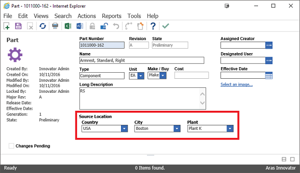

# Cascading Filtered Lists

This project demonstrates how cascading filtered lists can be implemented in Aras.

## Project Details

**Built Using:** Aras 11.0 SP7
**Browsers Tested:** Internet Explorer 11, Firefox 38 ESR, Chrome

> Though built and tested using Aras 11.0 SP7, this project should function in older releases of Aras 11.0 and Aras 10.0.

## How It Works

The project's import package adds properties and fields to the default Part ItemType/Form: `country`, `city`, and `plant`. The city property is filtered based on the selected country using the standard List - Filter List pair configuration.

Since the Aras GUI only supports one Filter List per List out-of-the-box, we add two methods to handle the filtering logic for our third list: `plant`. The labs_PopulatePlantList method filters and populates the Plant select list when the Part form is loaded. Whenever the City field value changes, the labs_UpdatePlantList method filters and repopulates the Plant select list.

The result is a filter list that appears to be filtered on a filter list.

## Installation

#### Important!
**Always back up your code tree and database before applying an import package or code tree patch!**

### Pre-requisites

1. Aras Innovator installed (version 11.0 SPx preferred)
2. Aras Package Import tool
3. CascadingFilteredLists import package

### Install Steps

1. Backup your database and store the BAK file in a safe place.
2. Open up the Aras Package Import tool.
3. Enter your login credentials and click **Login**
  * _Note: You must login as root for the package import to succeed!_
4. Enter the package name in the TargetRelease field.
  * Optional: Enter a description in the Description field.
5. Enter the path to your local `..\CascadingFilteredLists\Import\imports.mf` file in the Manifest File field.
6. Select **aras.labs.CascadingFilteredLists** in the Available for Import field.
7. Select Type = **Merge** and Mode = **Thorough Mode**.
8. Click **Import** in the top left corner.
9. Close the Aras Package Import tool.

You are now ready to login to Aras and try out cascading filtered lists.

## Usage

1. Log in to Aras as admin.
2. Navigate to **Design > Parts** in the table of contents (TOC).
3. Click the new item button to create a new Part.
4. Enter a name for the Part.
5. Use the new filtered lists to set the source location for the Part.
  * Country: Select a country first to filter the city list for valid options.
	* City: Select a city next to filter the plant list for valid options.
	* Plant: Select a plant located in your chosen city and country.
6. Save the Part.

## Contributing

1. Fork it!
2. Create your feature branch: `git checkout -b my-new-feature`
3. Commit your changes: `git commit -am 'Add some feature'`
4. Push to the branch: `git push origin my-new-feature`
5. Submit a pull request :D

For more information on contributing to this project, another Aras Labs project, or any Aras Community project, shoot us an email at araslabs@aras.com.

## License

Aras Labs projects are published to Github under the MIT license. See the [LICENSE file](./LICENSE.md) for license rights and limitations.
